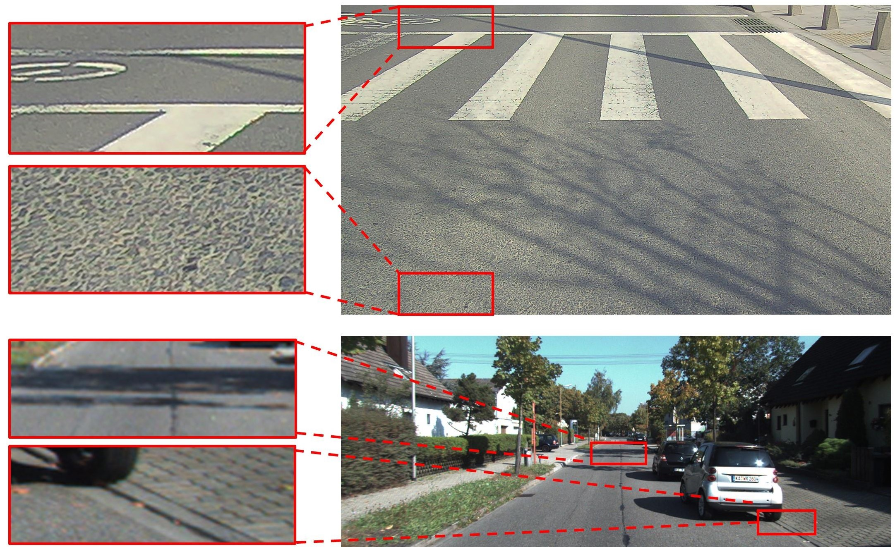
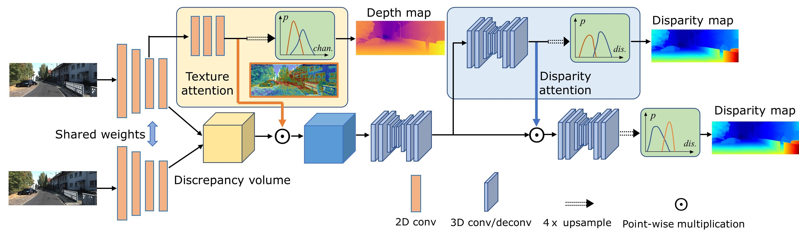
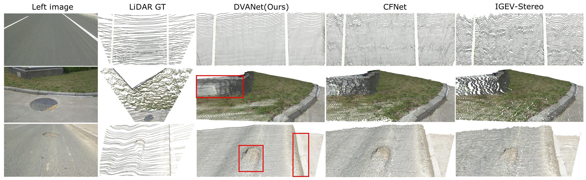

# DVANet
This is the implementation of the work: [Depth-aware Volume Attention for Texture-less Stereo Matching](https://arxiv.org/abs/2402.08931).

## Introduction
Stereo matching in large texture-less scenarios with perspective effect is challenging. In this paper, taking road surface as a typical scenario, we reveal the performance decrease due to the texture deterioration in natural images.
We introduce the depth-aware texture hierarchy attention and target-aware disparity attention modules to focus on the texture hierarchy. We propose a noval metric named Weighted Relative Depth Error (WRDE), which provides comprehensive 
assessment of depth-wise performance.




# How to use

## Environment
* Python 3.9
* Pytorch 1.11.0

## Install

### Create a virtual environment and activate it.

```
conda create -n dvanet python=3.9
conda activate dvanet
```
### Dependencies

```
conda install pytorch torchvision torchaudio cudatoolkit=11.3 -c pytorch -c nvidia
pip install opencv-python
pip install pillow
pip install tqdm
```

## Data Preparation
Download [RSRD](https://thu-rsxd.com/rsrd)(the subsets with half resolution), [Scene Flow](https://lmb.informatik.uni-freiburg.de/resources/datasets/SceneFlowDatasets.en.html), [KITTI 2012](http://www.cvlibs.net/datasets/kitti/eval_stereo_flow.php?benchmark=stereo), [KITTI 2015](http://www.cvlibs.net/datasets/kitti/eval_scene_flow.php?benchmark=stereo)

## Train
Use the following command to train DVANet on Scene Flow


```
python train.py --dataset 'sceneflow'
```

Use the following command to train DVANet on KITTI (using pretrained model on Scene Flow)
```
python train.py --dataset 'kitti' --loadckpt 'xxx.ckpt'
```

## Test
```
python test.py --dataset 'rsrd' --loadckpt 'xxx.ckpt'
```


### Pretrained Model

[Scene Flow](https://drive.google.com/file/d/1k3klSL3qmUTeRYW9SXuXFTcMhIOp7TF7/view?usp=sharing)

## Results on RSRD
| Method | EPE | >1px (%) | >2px (%) |
|:-:|:-:|:-:|:-:|
| IGEV-Stereo | 0.19 | 0.54 | 0.22 |
| CFNet | 0.18 | 0.90 | 0.17 |
| PSMNet | 0.17 | 0.63 | 0.16 |
| RAFT-Stereo | 0.17 | 0.43 | 0.17 |
| ACVNet | 0.16 | 0.59 | 0.15 |
| GwcNet | 0.16 | 0.57 | 0.14 |
| DVANet(Ours) | 0.15 | 0.34 | 0.14 |

## Results on KITTI 2012 leaderboard
[Leaderboard Link](https://www.cvlibs.net/datasets/kitti/eval_stereo_flow.php?benchmark=stereo)

| Method | Noc (%) | All (%) | # Params (M) |
|:-:|:-:|:-:|:-:|
| HITNet | 1.41 | 1.89 | - |
| GANet-15 | 1.36 | 1.80 | - |
| RAFT-Stereo | 1.30 | 1.66 | 11.1 |
| CFNet | 1.23 | 1.58 | 22.2 |
| AcfNet | 1.17 | 1.54 | 5.5 |
| ACVNet | 1.13 | 1.47 | 7.1 |
| IGEV-Stereo | 1.12 | 1.44 | 12.6 |
| DVANet(Ours) | 1.09 | 1.52 | 5.1 |

## Point cloud visualization on RSRD



# Citation

If you find this project helpful in your research, welcome to cite the paper.

```bibtex
@misc{zhao2024depthaware,
      title={Depth-aware Volume Attention for Texture-less Stereo Matching}, 
      author={Tong Zhao and Mingyu Ding and Wei Zhan and Masayoshi Tomizuka and Yintao Wei},
      year={2024},
      eprint={2402.08931},
      archivePrefix={arXiv},
      primaryClass={cs.CV}
}

```

# Acknowledgements

Thanks to the excellent work GwcNet and ACVNet. Our work is inspired by these works and part of codes are migrated from [GwcNet](https://github.com/xy-guo/GwcNet) and [ACVNet](https://github.com/gangweiX/ACVNet).
